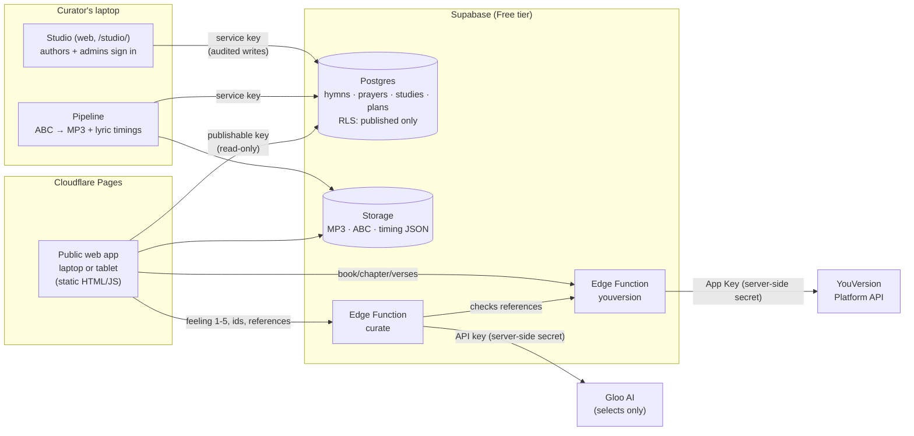

# Evergreen: Biblical connection for seniors


**Evergreen helps older Christians stay connected to the Word, even when reading, moving, or
remembering becomes difficult.** It runs in any modern browser, on a laptop or a tablet, with
big buttons and large print, and needs no login or personal information.

Live: **https://evergreen-ai.pages.dev/** · Gloo AI Hackathon, Track 2: *Scripture Beyond the App*

---

## Why

Today, 14.8 million Americans are 80 or older, a number expected to reach 25 million by 2035, and
nearly 80% identify as Christian. Yet older adults face at least seven of the ten life events
pastors feel ill-equipped to address.

The director of a 50-resident senior living community told us about a retired pastor whose family
gave him a Bible he could no longer read, because his eyesight was failing. His love for
Scripture remained. His access to it did not. (Our on-site conversations are in
`docs/VALIDATION.md`.)

Rather than another large-print Bible, Evergreen opens other doors to the Word: Scripture read
aloud, study guides, hymns tied to Scripture, and Bible games that gently exercise memory, all in
a simple, large-button interface. For that retired pastor, the answer isn't another Bible he
cannot read. It's a different way to interact with the Word he loves.

## How it works

```
 How are you feeling today?  ──►  My Day  ─────────────────────────────►  More
 five faces, one tap               a verse of the day (large print,        Read Scripture
 (Wonderful … Having a hard day)   Read aloud), chosen by Gloo AI          Worship: Sing a Hymn / Pray
                                   + four big buttons around it:           Games
                                   Hymn · Prayer · Game · Read             Start a Bible Study
```

1. **Tap how you feel.** Five large faces, from *Wonderful* to *Having a hard day*.
2. **My Day.** Gloo AI picks a **verse reference** for that feeling (the text comes live from
   YouVersion) and **four related activities**: hymns, prayers, a Bible quiz, or reading the
   chapter. Every passage and prayer has a **Read aloud** button.
3. **More** opens everything else:
   - **Read Scripture:** any chapter in large print, read aloud.
   - **Worship:** sing a familiar hymn with the words lit up as it plays, or pray a prayer from
     the library, shown with its source.
   - **Games:** Bible Trivia, plus Word Search and Crossword (work in progress), built from the
     passage itself. Nothing is scored.
   - **Start a Bible Study:** study plans written by pastors and approved before anyone sees them.

**The AI curates; it never writes Scripture, prayers or teaching.** No personal data is sent,
every pick is checked against our published catalog, and a non-AI fallback keeps Evergreen
working if the AI is unavailable (details in *AI curation* below).

**Who uses it:** a resident on their own, or with a family member, aide or chaplain beside them.
Pastors and chaplains build study plans in the **Studio** (`/studio/`), and an admin approves
each one. They also tune how the AI chooses the verse of the day.

## Study plans and modules

A **study plan** (e.g. "The Prodigal Son", "Good Soil") holds one or more **studies**, opened in
any order, with a big **Continue: Study 3** button and a ✓ by each study already done. Each study
is a short, calm session built in the Studio from **modules** in any order:
- Hymn
- Scripture (a reference; the text comes live from YouVersion)
- Prayer (from the library, with its source)
- Note (the author's own words)
- Quiz
- Finish the Line
- Bible Trivia, Word Search, Crossword (from the passage)

A new kind of module is **one file plus one line**: see `docs/MODULES.md`.

- **You are in charge of the pace.** Big **Back** and **Next** arrows sit on either side of the
  card. Nothing advances on its own, and *Play a game about this* is on every part.
- **Remembers on this device only:** where a study was left, and optional 👍 / 👎 notes on hymns
  and plans. There are no names, accounts or analytics.
- **Built for older eyes and hands:** works on a laptop or a tablet (landscape or portrait).
  Touch targets are 64 px or larger, session text 28 px or larger, with high contrast and no
  italics or thin type. It respects Reduce Motion and passes automated WCAG 2.2 AA checks.

## Architecture



| Part | What it does |
|---|---|
| **Pipeline** (`pipeline/`) | Reads 301 public-domain hymns from the Open Hymnal Project (ABC notation) and renders piano MP3s (abc2midi → FluidSynth → LAME, mono 96 kbps). It builds **word-by-word timings** by aligning the MIDI melody with the lyrics; 299/301 are verified. It imports 15 prayers verbatim from the Open Prayer Book. |
| **Studio** (`web/studio/`) | A web app anyone can sign in to (magic link). Authors build **study plans** from modules in any order, preview them exactly as the app plays them, and submit them for review. Admins approve or send back plans, manage the hymn and prayer libraries, and see the audit log. **Every change is audited by the database.** |
| **Supabase** (`supabase/`) | Postgres with Row Level Security, so the public key sees **published** content only. Public Storage holds the audio. The `youversion` Edge Function keeps the YouVersion key server-side and adds CORS and rate limiting. The `curate` Edge Function asks Gloo AI for picks and checks every one against the published catalog. |
| **Public app** (`web/`) | Static, no build step, on Cloudflare Pages; runs in any modern browser on a laptop or tablet. Web Audio crossfades and ducks the music; the browser's own speech voices read aloud on request; abcjs draws the sheet music with a moving cursor. |

Runs at **$0** on Supabase Free + Cloudflare Pages. See `docs/DEPLOY.md` for the runbook and cost
math. An average hymn is about 2 MB, so 5 GB/month ≈ 2,400 plays.

## Guardrails

- **No generated religious content.** The app never writes prayers, Scripture or theological text:
  - **Prayers** are imported **verbatim** from the Open Prayer Book. The importer stops rather than
    guess, and any prayer added later requires a **source**.
  - **Scripture** is fetched **live from YouVersion** with its attribution. Verse text is never
    stored in the database or the repo.
- **AI selects, it never writes.** There's no chatbot and no generated audio, music or images.
  AI (Gloo AI) only **chooses and arranges** vetted content: published hymns and prayers, and
  Scripture **references** whose text comes live from YouVersion. Every choice is checked on the
  server and in the browser, and every AI step has a fallback that works without it. See
  *AI curation* below. Music is rendered from public-domain notation. **Read-aloud is off by
  default** in study plans, because the built-in voices still sound robotic; it can be switched on
  in Aide tools or in any study, and it uses only the device's own voice. Every
  passage and prayer on screen also has its own **Read aloud** button, which reads it once on request.
- **Public domain only.** The 40 published hymns pass a strict rule: the ABC file says *public
  domain*, and the claim doesn't rest on a modern hymnal transcription or a "never renewed"
  argument (`supabase/seed/publish_pd_hymns.py`). The Studio applies the same rule, reading the
  hymn's ABC file, whenever an admin publishes a hymn.
- **Privacy:** no login and no personal information for the people using it, and no analytics.
  Progress and notes stay in the browser's `localStorage` on that device. Only **authors** sign in to the
  Studio (email only, visible to admins). The service-role key never leaves the curator's laptop.
- **Dignity:** no streaks, badges, scores or "you missed a day" messages, and no medical claims.
- **Moderation:** anyone may *build* a plan, but nothing reaches residents until an **admin approves
  it**. The database enforces this (RLS plus a status trigger: authors can't publish). Approval is
  refused while a plan uses unpublished hymns or prayers, and every change is audit-logged with
  the signer's email.

## AI curation

Everyone starts with **"How are you feeling today?"** (five faces, from *Wonderful* to *Having a
hard day*). One tap opens **My Day**: a verse of the day in large print and four big buttons
(any mix of hymns, prayers, reading and a Bible quiz around it), then **More** for everything
else (Read Scripture, Worship, Games, Start a Bible Study). Games can also be opened from any
study part (*Play a game about this*).

| | What the AI does | What it never does |
|---|---|---|
| **Verse of the day** | Thinks step by step (a chain-of-thought prompt with example passages per feeling, edited by admins in the Studio's **AI prompt** page) and returns a **reference** of 1–3 verses | Write or paraphrase Scripture. The reference is checked (real book and chapter, 1–3 verses, found on YouVersion), else an example passage is used |
| **Four picks** | Chooses published hymns and prayers by id, and games or reading about the verse; a kind may repeat if the items differ | Choose anything unpublished, unknown or marked 👎 (dropped by the server); missing picks are filled at random |
| **Games** | Picks the game and difficulty; for trivia, writes "what does the passage say" questions **from the verse text sent with the request** | Put an answer in a question that isn't word for word in its verse: the server and the browser both drop it; fewer than 2 left → fill-in-the-blank built in the browser. Word search and crossword (work in progress) use no AI at all |

- **Data sent:** the feeling (a number 1–5), hymn and prayer ids, Scripture references, module
  types and 👍/👎 / open counts from this device. **No names or personal data.** The feeling is
  kept for this visit only (`sessionStorage`). History stays in the browser's `localStorage`.
  Verse text goes to the AI only for trivia, for that one request, and is never stored.
- **Fallback:** if the AI is down, slow (13 s for the verse of the day, 5 s otherwise) or returns
  nothing valid, the app quietly uses a random pick from published content. Nothing breaks or hangs.
- **No scores:** answers are revealed gently with the verse; no streaks, timers or "wrong".
- **Provider:** Gloo AI Studio (Completions V2, `auto_routing`), behind one adapter function in
  `supabase/functions/curate/index.ts`. Any OpenAI-compatible API can be swapped in with
  `LLM_API_URL` / `LLM_API_KEY` / `LLM_MODEL`. The key is a Supabase secret, never in the browser.
- **Studio "AI prompt" page (admins):** edit the guidance (tone, what to prefer or avoid) and, per
  feeling, the themes and example passages; "Try it" asks the AI exactly as the app would. The safety
  rules stay fixed in the function and are shown read-only. The database checks every save
  (5 feelings, 1–8 references of 1–3 verses, no text) and the audit log records who changed it
  (table `ai_prompts`, migration 0010).
- **A small badge** on each AI-chosen thing (verse of the day, "Picked for you", a game, trivia
  questions): filled ✦ = chosen with Gloo AI; crossed-out ✦ = Gloo AI was skipped (random pick or
  questions built in the browser). Its name says which, for screen readers too.
- **Show AI reasoning** (Aide tools) shows a one-line "why" for each choice, for aides and judges.

## Sources and licenses

**Our code is MIT-licensed** (`LICENSE`). Third-party content keeps its own license:

| What | Source | License |
|---|---|---|
| Hymn words and music (ABC) | [Open Hymnal Project](http://openhymnal.org/) ([mirror](https://github.com/mzealey/openhymnal)) | Public domain, per each file's `copyright: public domain` line |
| Prayers | [Open Prayer Book](https://github.com/freebcp/open-prayer-book): Book of Common Prayer 1662 and 1979 | CC0 1.0 (`docs/licenses/open-prayer-book-LICENSE.txt`); the texts are public domain |
| Scripture | **American Standard Version (ASV)** via the [YouVersion Platform](https://platform.youversion.com/) | ASV is public domain. Delivered under YouVersion's Platform Terms (non-commercial), with attribution shown under every passage |
| Hymn audio | Rendered by us with the FluidR3_GM SoundFont (Frank Wen) | MIT (`docs/licenses/FluidR3_GM-MIT.txt`) |
| Sheet music + timing alignment | [abcjs](https://www.abcjs.net/) 6.7.1, [@tonejs/midi](https://github.com/Tonejs/Midi) | MIT |
| Data access | [supabase-js](https://github.com/supabase/supabase-js) 2.117.2, supabase-py | MIT |
| AI curation | Gloo AI Studio API | Gloo's terms of service |
| Fonts | The device's own sans-serif fonts (Verdana, Helvetica, Calibri); none are bundled | n/a |

## Repository map

| Folder | Contents |
|---|---|
| `web/` | Public app: `index.html`, `js/` (screens, navigation, AI curation client, audio/speech/lyrics/sheet), `css/`, `img/` (Evergreen logos) |
| `web/studio/` | Studio: sign in, build and review study plans, manage libraries, edit the AI prompt |
| `web/modules/` | One file per module (hymn, scripture, prayer, note, quiz, finish-line, trivia, word-search, crossword) + the registry |
| `pipeline/` | Hymn and prayer importers, MP3 renderer, lyric-timing builder |
| `supabase/` | Migrations + RLS, the `youversion` and `curate` Edge Functions, seed scripts, tests |
| `tests/browser/` | End-to-end and accessibility checks (Playwright + axe-core, dev-only) |
| `docs/` | `DEPLOY.md` (runbook), `TESTING.md`, `MODULES.md`, `VALIDATION.md`, `PLAN.md`, `licenses/` |
| `logos/` | Original Evergreen logo files |
| `archive/` | Retired code kept for reference (the old My Day screen) |

## Status and testing

- **Live:** `main` is deployed to https://evergreen-ai.pages.dev/ (Cloudflare Pages).
- **Automated checks** (`tests/browser/`, headless Chromium + axe-core):
  - welcome → My Day → More, navigation, the AI-down fallback, a fabricated trivia answer
    dropped, games playable (`curation.mjs`): 37/37
  - end to end, study plans (`e2e.mjs`): 15/15
  - Studio AI prompt page, as an admin and an author (`ai_prompt.mjs`): 11/11
  - Studio security as real users: 39/39 · RLS: 19/19
  - Edge Functions: `youversion` 22/22, `curate` 23
  - axe-core: 0 issues on every screen checked
- **Manual device checks:** `docs/TESTING.md`.

## Known gaps

Things that are unfinished or limited, listed plainly:

**Future work: a natural reading voice**
- The devices' built-in text-to-speech voices sound robotic, even the best ones. So automatic
  read-aloud in study plans is **off by default**, and every passage and prayer has its own
  **Read aloud** button instead.
- We **chose not to use AI-generated voices**, whether on the device, from a local model, or from a
  cloud service.
- Open directions:
  - **Human recordings** (for example, a pastor or volunteer recording the 15 prayers line by line
    in the Studio)
  - **public-domain human audio Bibles** matched to the translation on screen
  - making it easier to pick a device's best installed voice

**Future work: AI curation**
- **Theme-based verse lists from YouVersion:** ask the YouVersion API for passages on a theme
  (comfort, joy, rest…) instead of relying on our own example list.
- **Pastoral review of the example passages** per feeling (a draft today).
- Thumbs up / down on the four My Day picks (today they're on hymns and plans).

**Not yet verified on real devices**
- The demos so far ran on a laptop. Still to check by hand: the read-aloud voice on a tablet
  (Safari), Web Audio with a tablet's **silent/mute switch** on, and a **screen reader** pass
  (VoiceOver / NVDA). Automated tests run headless, which has no voices.

**Content**
- **40 hymns** are published. 261 more are imported but unpublished.
- **Audio exists for 50 hymns** only. Rendering all 301 would use about 640 MB, over our 600 MB
  storage target.
- **Two hymns** have unverified timing (#106 *I Bind Unto Myself Today*, #263 *The Strife Is
  O'er*): their words show without highlighting. **Two** play only their first stanza (#100
  *Holy, Holy, Holy*, #186 *O Come, All Ye Faithful*), a limit of the Open Hymnal tooling.
- **Source-data errors** are flagged in the admin dashboard but not fixed: #65 cites 1
  Thessalonians 6, which doesn't exist; #232 has a reversed verse range.
- A 30-day sample plan is still a draft awaiting review. Some study *titles* still read
  "Psalms 23" (admin-only labels).
- Three **seasonal** hymns (two Christmas, one Easter) are published year-round in Sing a Hymn.
- **One translation** (ASV) and **English only**.

**App**
- **Needs a network connection.** There's no offline mode or installable PWA yet.
- **Libraries load from jsDelivr** (supabase-js, abcjs), so the device's IP address reaches that
  CDN. Self-hosting them would remove that.
- **Notes stay on one device.** By design there are no accounts, so notes don't follow a person
  between devices.
- **Hymn topics** are imported but not yet used, e.g. for choosing a hymn by theme.
- The **Edge Function's in-memory cache** rarely helps, because hosted instances are short-lived.
  Browser caching does the real work.
- The **rate limit** counts by IP address. Devices behind one facility network share 60
  Scripture requests/minute, which is plenty for sessions but worth knowing. YouVersion's own
  quota can run out under heavy testing; an optional backup App Key is supported (`docs/DEPLOY.md` A4).

**Studio, admin and pipeline**
- **Sign-in emails:** Supabase's built-in sender allows only **about 2 per hour**. Real use needs a
  free custom SMTP (`docs/DEPLOY.md` A6b).
- **The first admin is made with one SQL line** after they sign in. After that, admins promote
  others in the Studio.
- **Authors write notes and quizzes in their own words.** An admin review is the safeguard before
  that text reaches residents. Scripture and prayers can only be *referenced*, and the database
  enforces that.
- **Importing hymns and rendering audio** still runs from the terminal (`pipeline/`). The Studio
  manages what's already imported.
- **Preview of hymns that aren't published yet:** the preview plays exactly what the app would,
  so unpublished hymns show as unavailable.
- **The old day-based plan tables** (`plans`, `plan_days`, `studies`) are still in the database.
  `main` used them until this branch, and they're no longer read by the app. Drop them in a later
  migration once `studio` is merged.
- The free **keep-alive** workflow ships disabled. Without it or a Pro plan, the Supabase project
  pauses after 7 idle days (`docs/DEPLOY.md` Part D explains restoring it).

**Validation**
- `docs/VALIDATION.md` records two on-site conversations (Oct 3, 2026) with a senior living
  community's director and a retired pastor who lives there: our assumptions, what was wrong, and
  what we changed.
