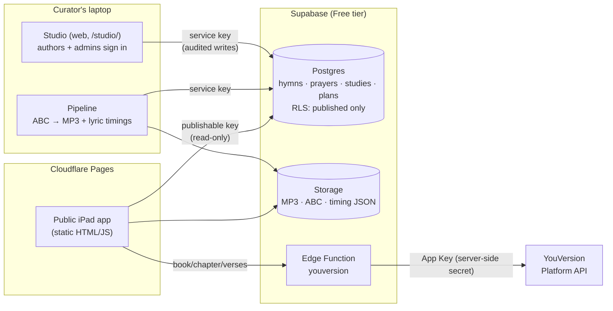

# Hymnal Reader

**A daily hymn, a short Scripture passage, and a prayer, made simple enough to share with a
resident in memory care.** It runs on an iPad, is used together with an aide, and needs no
accounts.

Live: **https://hymnal-reader-v2.pages.dev/** · Gloo AI Hackathon, Track 2: *Scripture Beyond the App*

---

## Who it serves, and the problem

Many older adults in senior living grew up singing hymns and praying the same prayers week after
week. For residents living with Alzheimer's or other memory loss, today's Bible apps aren't built
for that moment:
- small text and busy screens
- many choices
- sign-ins
- streaks and notifications

The **aide** who would sit with them has a few spare minutes, not time to prepare a devotion.

Hymnal Reader gives the aide **one big button**: *Choose a Study Plan*. A pastor publishes a
**study plan** (for example, "Comfort in the evening", or a 12-week series) that holds one or more
**studies**. On the tablet you pick a plan, then walk through its studies in any order. The plan
page shows a big **Continue: Study 3** button and a ✓ next to each study already done. That
progress is kept on the tablet only, with no accounts. Each study is a short, calm session in large
type, with nothing to set up. A typical one has:
- a well-known hymn, sung along with the words highlighted
- a short passage in large print, read by the aide or together (the tablet can also read it aloud, if the aide turns that on)
- a familiar prayer

Plans are built in the **Studio** (`/studio/`). Anyone can sign in, add studies to a plan (or copy a
study from another plan), and build each study from **modules** in any order:
- hymns
- Scripture
- prayers
- their own notes
- gentle quizzes
- a sing-along "Finish the Line" game

An admin reviews each plan before it reaches the tablets.

## A study plan, its studies, and their modules

```
 Home ──► Choose a Study Plan ──► the plan ──────────────► a study: Part 1 · Hymn ──► Part 2 · Scripture ──► Part 3 · Note ──► … ──► Finished
  │       big cards: title,       "Continue: Study 3"       sing-along words lit     read aloud verse by    the author's own       "Next: Study 4"
  │       "3 of 12 done",         ✓ Study 1  ✓ Study 2      as sung; sheet music     verse, music softly    words (quizzes:        or back to
  │       "Enjoyed before"        ▸ Study 3 (Next up) …     on request               underneath             nothing is scored)     the plan
  ├──► Sing a Hymn   3×3 grid of familiar hymns ("Enjoyed before" first)
  ├──► Read the Bible   large print, read aloud
  └──► Aide tools   read aloud On/Off (off by default), reading speed, volume, voice, reset notes
```

**Modules today:**
- Hymn
- Scripture (a reference; the text comes live from YouVersion)
- Prayer (from the library, with its source)
- Note
- Quiz
- Finish the Line

A new kind of module is **one file plus one line**: see `docs/MODULES.md`.

- **The aide is in charge.** Big **Back** and **Next** arrows, as tall as the card, sit on either
  side of it; **Sing/Read again** and **Pause** are below. Nothing
  advances on its own, and nothing changes when you scroll.
- **Remembers on the tablet only:** where a study was left, and optional 👍 *Enjoyed it* / 👎 *Skip
  next time* notes per study and per hymn. There are no names, accounts or analytics.
- **Built for the iPad:** landscape first, works in portrait. Touch targets are 64 px or larger,
  session text 28 px or larger. It respects Reduce Motion and passes automated WCAG 2.2 AA checks.

## Architecture



| Part | What it does |
|---|---|
| **Pipeline** (`pipeline/`) | Reads 301 public-domain hymns from the Open Hymnal Project (ABC notation) and renders piano MP3s (abc2midi → FluidSynth → LAME, mono 96 kbps). It builds **word-by-word timings** by aligning the MIDI melody with the lyrics; 299/301 are verified. It imports 15 prayers verbatim from the Open Prayer Book. |
| **Studio** (`web/studio/`) | A web app anyone can sign in to (magic link). Authors build **study plans** from modules in any order, preview them exactly as a tablet plays them, and submit them for review. Admins approve or send back plans, manage the hymn and prayer libraries, and see the audit log. **Every change is audited by the database.** |
| **Supabase** (`supabase/`) | Postgres with Row Level Security, so the public key sees **published** content only. Public Storage holds the audio. The `youversion` Edge Function keeps the YouVersion key server-side and adds CORS and rate limiting. |
| **Public app** (`web/`) | Static, no build step, on Cloudflare Pages. Web Audio crossfades and ducks the music; the browser's own speech voices can read aloud (off by default); abcjs draws the sheet music with a moving cursor. |

Runs at **$0** on Supabase Free + Cloudflare Pages. See `docs/DEPLOY.md` for the runbook and cost
math. An average hymn is about 2 MB, so 5 GB/month ≈ 2,400 plays.

## Guardrails

- **No generated religious content.** The app never writes prayers, Scripture or theological text:
  - **Prayers** are imported **verbatim** from the Open Prayer Book. The importer stops rather than
    guess, and any prayer added later requires a **source**.
  - **Scripture** is fetched **live from YouVersion** with its attribution. Verse text is never
    stored in the database or the repo.
- **AI selects, it never writes.** There's no chatbot and no generated audio, music or images.
  AI (Gloo AI) only **chooses and arranges** vetted content: published hymns and prayers, and
  Scripture **references** whose text comes live from YouVersion. Every choice is checked on the
  server and the tablet, and every AI step has a fallback that works without it. See
  *AI curation* below. Music is rendered from public-domain notation. **Read-aloud is off by
  default**, because the built-in voices still sound robotic. When an aide turns it on (in Aide
  tools, or the *Read aloud* button in any study), it uses only the device's own voice. Every
  passage and prayer on screen also has its own **Read aloud** button, which reads it once on request.
- **Public domain only.** The 40 published hymns pass a strict rule: the ABC file says *public
  domain*, and the claim doesn't rest on a modern hymnal transcription or a "never renewed"
  argument (`supabase/seed/publish_pd_hymns.py`). The Studio applies the same rule, reading the
  hymn's ABC file, whenever an admin publishes a hymn.
- **Privacy:** residents have no accounts, and there's no personal data or analytics about
  them. Progress and notes stay in the tablet's `localStorage`. Only **authors** sign in to the
  Studio (email only, visible to admins). The service-role key never leaves the curator's laptop.
- **Dignity:** no streaks, badges, scores or "you missed a day" messages, and no medical claims.
- **Moderation:** anyone may *build* a plan, but nothing reaches residents until an **admin approves
  it**. The database enforces this (RLS plus a status trigger: authors can't publish). Approval is
  refused while a plan uses unpublished hymns or prayers, and every change is audit-logged with
  the signer's email.

## AI curation

The resident starts with **"How are you feeling today?"** (five faces, from *Wonderful* to *Having
a hard day*). One tap opens **Chosen for you**: a verse of the day in large print and four big
buttons (any mix of hymns, prayers, reading and games around it), then **Engage further** for
everything else (Read Scripture, Worship, Games, Start a Bible Study). Games can also be opened
from any study part (*Play a game about this*).

| | What the AI does | What it never does |
|---|---|---|
| **Verse of the day** | Thinks step by step (a chain-of-thought prompt with example passages per feeling, edited by admins in the Studio's **AI prompt** page) and returns a **reference** of 1–3 verses | Write or paraphrase Scripture. The reference is checked (real book and chapter, 1–3 verses, found on YouVersion), else an example passage is used |
| **Four picks** | Chooses published hymns and prayers by id, and games or reading about the verse; a kind may repeat if the items differ | Choose anything unpublished, unknown or marked 👎 (dropped by the server); missing picks are filled at random |
| **Games** | Picks the game and difficulty; for trivia, writes "what does the passage say" questions **from the verse text sent with the request** | Put an answer in a question that isn't word for word in its verse: the server and the tablet both drop it; fewer than 2 left → fill-in-the-blank built on the tablet. Word search and crossword are built on the tablet with no AI at all |

- **Data sent:** the feeling (a number 1–5), hymn and prayer ids, Scripture references, module
  types and 👍/👎 / open counts from this tablet. **No names or personal data.** The feeling is
  kept for this visit only (`sessionStorage`). History stays in the tablet's `localStorage`.
  Verse text goes to the AI only for trivia, for that one request, and is never stored.
- **Fallback:** if the AI is down, slow (10 s for the verse, 5 s otherwise) or returns nothing
  valid, the tablet quietly uses a random pick from published content. Nothing breaks or hangs.
- **No scores:** answers are revealed gently with the verse; no streaks, timers or "wrong".
- **Provider:** Gloo AI Studio (Completions V2, `auto_routing`), behind one adapter function in
  `supabase/functions/curate/index.ts`. Any OpenAI-compatible API can be swapped in with
  `LLM_API_URL` / `LLM_API_KEY` / `LLM_MODEL`. The key is a Supabase secret, never in the browser.
- **Studio "AI prompt" page (admins):** edit the guidance (tone, what to prefer or avoid) and, per
  feeling, the themes and example passages; "Try it" asks the AI as a tablet would. The safety
  rules stay fixed in the function and are shown read-only. The database checks every save
  (5 feelings, 1–8 references of 1–3 verses, no text) and the audit log records who changed it
  (table `ai_prompts`, migration 0010).
- **A small badge** on each AI-chosen thing (verse of the day, "Picked for you", a game, trivia
  questions): filled ✦ = chosen with Gloo AI; crossed-out ✦ = Gloo AI was skipped (random pick or
  questions built on the tablet). Its name says which, for screen readers too.
- **Show AI reasoning** (Aide tools) shows a one-line "why" for each choice, for aides and judges.

## Sources and licenses

| What | Source | License |
|---|---|---|
| Hymn words and music (ABC) | [Open Hymnal Project](http://openhymnal.org/) ([mirror](https://github.com/mzealey/openhymnal)) | Public domain, per each file's `copyright: public domain` line |
| Prayers | [Open Prayer Book](https://github.com/freebcp/open-prayer-book): Book of Common Prayer 1662 and 1979 | CC0 1.0 (`docs/licenses/open-prayer-book-LICENSE.txt`); the texts are public domain |
| Scripture | **American Standard Version (ASV)** via the [YouVersion Platform](https://platform.youversion.com/) | ASV is public domain. Delivered under YouVersion's Platform Terms (non-commercial), with attribution shown under every passage |
| Hymn audio | Rendered by us with the FluidR3_GM SoundFont (Frank Wen) | MIT (`docs/licenses/FluidR3_GM-MIT.txt`) |
| Sheet music + timing alignment | [abcjs](https://www.abcjs.net/) 6.7.1, [@tonejs/midi](https://github.com/Tonejs/Midi) | MIT |
| Data access | [supabase-js](https://github.com/supabase/supabase-js) 2.117.2, supabase-py | MIT |
| Fonts | Literata, Atkinson Hyperlegible (Google Fonts) | SIL Open Font License |

## Repository map

| Folder | Contents |
|---|---|
| `web/` | Public app: `index.html`, `js/` (screens + audio/speech/lyrics/sheet modules), `css/` |
| `web/studio/` | Studio: sign in, build and review study plans, manage libraries |
| `web/modules/` | One file per module (hymn, scripture, prayer, note, quiz, finish-line) + the registry |
| `pipeline/` | Hymn and prayer importers, MP3 renderer, lyric-timing builder |
| `supabase/` | Migrations + RLS, the `youversion` Edge Function, seed scripts, RLS test |
| `tests/browser/` | End-to-end and accessibility checks (Playwright + axe-core, dev-only) |
| `docs/` | `DEPLOY.md` (runbook), `TESTING.md`, `PLAN.md`, `VALIDATION.md`, `licenses/` |

## Status and testing

- Production (`main`) runs the day-based version. The **`studio` branch** adds the Studio and
  modular study plans. Its preview is at `https://studio.hymnal-reader-v2.pages.dev/`.
- **Automated checks on `studio`:**
  - Studio security as real users: 32/32
  - Studio end to end (author builds, previews, submits; admin approves; tablet lists it): 27/27
  - a plan using every module type: 17/17
  - tablet end to end: 14/14
  - RLS: 19/19
  - Edge Function: 22/22
  - axe-core: 0 issues on every tablet and Studio screen checked
- **Manual device checks:** `docs/TESTING.md`.

## Known gaps

Things that are unfinished or limited, listed plainly:

**Future work: a natural reading voice**
- The devices' built-in text-to-speech voices sound robotic, even the best ones on an iPad. So
  **read-aloud is off by default**: Scripture, prayers and notes are shown in large print for the
  aide to read, or for everyone to read together. Aides can switch the device voice on when it helps.
- We **chose not to use AI-generated voices**, whether on the device, from a local model, or from a
  cloud service.
- Open directions:
  - **Human recordings** (for example, a pastor or volunteer recording the 15 prayers line by line
    in the Studio)
  - **public-domain human audio Bibles** matched to the translation on screen
  - making it easier to pick a device's best installed voice

**Future work: AI curation**
- **Theme-based verse lists from YouVersion:** ask the YouVersion API for passages on a theme
  (comfort, joy, rest…) instead of relying on our own example list.
- **Pastoral review of the example passages** per feeling (a draft today).
- Thumbs up / down on the four "Chosen for you" picks (today they're on hymns and plans).

**Not yet verified on real devices**
- Hearing the read-aloud voice on an **iPad** (Safari). All automated tests run headless, which has
  no voices.
- How iPads treat Web Audio with the **silent/mute switch** on.
- A **VoiceOver** pass on the iPad. Automated checks pass, but no screen-reader user has tested it.

**Content**
- **40 hymns** are published. 261 more are imported but unpublished.
- **Audio exists for 50 hymns** only. Rendering all 301 would use about 640 MB, over our 600 MB
  storage target.
- **Two hymns** have unverified timing (#106 *I Bind Unto Myself Today*, #263 *The Strife Is
  O'er*): their words show without highlighting. **Two** play only their first stanza (#100
  *Holy, Holy, Holy*, #186 *O Come, All Ye Faithful*), a limit of the Open Hymnal tooling.
- **Source-data errors** are flagged in the admin dashboard but not fixed: #65 cites 1
  Thessalonians 6, which doesn't exist; #232 has a reversed verse range.
- The **"Memory Care — 30 Days"** plan is a draft awaiting review. Only the 12-day sample is
  published. Some study *titles* still read "Psalms 23" (admin-only labels).
- Three **seasonal** hymns (two Christmas, one Easter) are published year-round in Sing a Hymn.
- **One translation** (ASV) and **English only**.

**App**
- **Needs a network connection.** There's no offline mode or installable PWA yet.
- **Fonts load from Google Fonts** and libraries from jsDelivr, so a tablet's IP address reaches
  those CDNs. Self-hosting them would remove that.
- **Notes stay on one tablet.** By design there are no accounts, so notes don't follow a resident
  between devices.
- **Hymn topics** are imported but not yet used, e.g. for choosing a hymn by theme.
- The **Edge Function's in-memory cache** rarely helps, because hosted instances are short-lived.
  Browser caching does the real work.
- The **rate limit** counts by IP address. Tablets behind one facility network share 60
  requests/minute, which is plenty for sessions but worth knowing.

**Studio, admin and pipeline**
- **Sign-in emails:** Supabase's built-in sender allows only **about 2 per hour**. Real use needs a
  free custom SMTP (`docs/DEPLOY.md` A6b).
- **The first admin is made with one SQL line** after they sign in. After that, admins promote
  others in the Studio.
- **Authors write notes and quizzes in their own words.** An admin review is the safeguard before
  that text reaches residents. Scripture and prayers can only be *referenced*, and the database
  enforces that.
- **Importing hymns and rendering audio** still runs from the terminal (`pipeline/`). The Studio
  manages what's already imported.
- **Preview of hymns that aren't published yet:** the preview plays exactly what a tablet would,
  so unpublished hymns show as unavailable.
- **The old day-based plan tables** (`plans`, `plan_days`, `studies`) are still in the database.
  `main` used them until this branch, and they're no longer read by the app. Drop them in a later
  migration once `studio` is merged.
- The free **keep-alive** workflow ships disabled. Without it or a Pro plan, the Supabase project
  pauses after 7 idle days (`docs/DEPLOY.md` Part D explains restoring it).

**Validation**
- `docs/VALIDATION.md` is a **template**: field conversations with residents, aides and chaplains
  are still to be recorded there.
