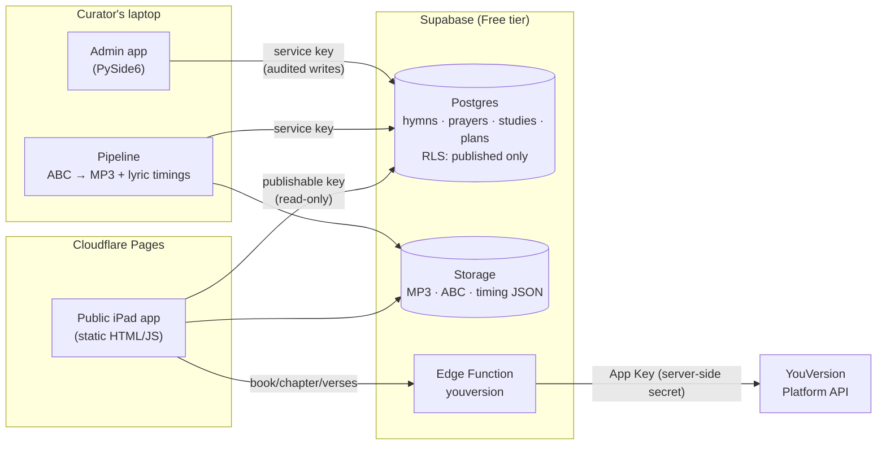

# Hymnal Reader

**A daily hymn, a short Scripture passage, and a prayer, made simple enough to share with a
resident in memory care.** It runs on an iPad, is used together with an aide, and needs no
accounts.

Live: **https://hymnal-reader-v2.pages.dev/** · Gloo AI Hackathon, Track 2: *Scripture Beyond the App*

---

## Who it serves, and the problem

Many older adults in senior living grew up singing hymns and praying the same prayers week after
week. For residents living with Alzheimer's or other memory loss, today's Bible apps aren't built
for that moment:
- small text and busy screens
- many choices
- sign-ins
- streaks and notifications

The **aide** who would sit with them has a few spare minutes, not time to prepare a devotion.

Hymnal Reader gives the aide **one big button**: *Today's Hymn & Verse*. Behind it is a short,
calm session:
- a well-known hymn, sung along with the words highlighted
- a short passage read aloud at a gentle pace
- a familiar prayer

All of it is in large type, with nothing to set up.

## The session (about 5–8 minutes)

```
 Home ──► 1 · Hymn ──────► 2 · Scripture ────────► 3 · Prayer ─────► Finished
  │       piano hymn        1–6 verses, read        a Book of Common    "Day 2 will be
  │       with sing-along   aloud verse by verse    Prayer prayer,      ready next time."
  │       words lit as      (music softly           read line by line
  │       they're sung;     underneath, lowered     with the current
  │       sheet music       while the voice         line highlighted
  │       on request        reads)
  ├──► Sing a Hymn   3×3 grid of familiar hymns ("Enjoyed before" first)
  ├──► Read the Bible   large print, read aloud
  └──► Aide tools   choose a day, reading speed (Slower/Slow/Normal), volume, voice
```

- **The aide is in charge.** Big **Back · Sing/Read again · Pause · Next** buttons. Nothing
  advances on its own, and nothing changes when you scroll.
- **Remembers on the tablet only:** which day is next, and optional *Enjoyed it* / *Skip next
  time* notes per hymn. There are no names, accounts or analytics.
- **Built for the iPad:** landscape first, works in portrait. Touch targets are 64 px or larger,
  session text 28 px or larger. It respects Reduce Motion and passes automated WCAG 2.2 AA checks.

## Architecture



| Part | What it does |
|---|---|
| **Pipeline** (`pipeline/`) | Reads 301 public-domain hymns from the Open Hymnal Project (ABC notation) and renders piano MP3s (abc2midi → FluidSynth → LAME, mono 96 kbps). It builds **word-by-word timings** by aligning the MIDI melody with the lyrics; 299/301 are verified. It imports 15 prayers verbatim from the Open Prayer Book. |
| **Admin app** (`admin/`) | A desktop curation tool. It publishes hymns and prayers, builds studies (hymn + passage + prayer, with a live preview) and multi-day plans. **Every change is in an audit log.** A plan can only be published when everything in it is published. |
| **Supabase** (`supabase/`) | Postgres with Row Level Security, so the public key sees **published** content only. Public Storage holds the audio. The `youversion` Edge Function keeps the YouVersion key server-side and adds CORS and rate limiting. |
| **Public app** (`web/`) | Static, no build step, on Cloudflare Pages. Web Audio crossfades and ducks the music; the browser's own speech voices read aloud; abcjs draws the sheet music with a moving cursor. |

Runs at **$0** on Supabase Free + Cloudflare Pages. See `docs/DEPLOY.md` for the runbook and cost
math. An average hymn is about 2 MB, so 5 GB/month ≈ 2,400 plays.

## Guardrails

- **No generated religious content.** The app never writes prayers, Scripture or theological text:
  - **Prayers** are imported **verbatim** from the Open Prayer Book. The importer stops rather than
    guess, and any prayer added later requires a **source**.
  - **Scripture** is fetched **live from YouVersion** with its attribution. Verse text is never
    stored in the database or the repo.
- **No AI in the resident's experience.** No chatbot, no generated audio, music or images. Voices
  are the device's own built-in voices; music is rendered from public-domain notation.
- **Public domain only.** The 40 published hymns pass a strict rule: the ABC file says *public
  domain*, and the claim doesn't rest on a modern hymnal transcription or a "never renewed"
  argument (`supabase/seed/publish_pd_hymns.py`).
- **Privacy:** no accounts, no personal data, no analytics. Progress and notes stay in the
  tablet's `localStorage`. The service-role key never leaves the curator's laptop.
- **Dignity:** no streaks, badges, scores or "you missed a day" messages, and no medical claims.
- **Moderation:** drafts never reach residents. Content goes draft → approved → **published**,
  enforced in the database (RLS), with an audit trail of who changed what.

## Sources and licenses

| What | Source | License |
|---|---|---|
| Hymn words and music (ABC) | [Open Hymnal Project](http://openhymnal.org/) ([mirror](https://github.com/mzealey/openhymnal)) | Public domain, per each file's `copyright: public domain` line |
| Prayers | [Open Prayer Book](https://github.com/freebcp/open-prayer-book): Book of Common Prayer 1662 and 1979 | CC0 1.0 (`docs/licenses/open-prayer-book-LICENSE.txt`); the texts are public domain |
| Scripture | **American Standard Version (ASV)** via the [YouVersion Platform](https://platform.youversion.com/) | ASV is public domain. Delivered under YouVersion's Platform Terms (non-commercial), with attribution shown under every passage |
| Hymn audio | Rendered by us with the FluidR3_GM SoundFont (Frank Wen) | MIT (`docs/licenses/FluidR3_GM-MIT.txt`) |
| Sheet music + timing alignment | [abcjs](https://www.abcjs.net/) 6.7.1, [@tonejs/midi](https://github.com/Tonejs/Midi) | MIT |
| Data access | [supabase-js](https://github.com/supabase/supabase-js) 2.117.2, supabase-py | MIT |
| Fonts | Literata, Atkinson Hyperlegible (Google Fonts) | SIL Open Font License |
| Admin app UI | PySide6 (Qt for Python) | LGPL v3 |

## Repository map

| Folder | Contents |
|---|---|
| `web/` | Public app: `index.html`, `js/` (screens + audio/speech/lyrics/sheet modules), `css/` |
| `admin/` | PySide6 admin app (`python admin/app.py`) |
| `pipeline/` | Hymn and prayer importers, MP3 renderer, lyric-timing builder |
| `supabase/` | Migrations + RLS, the `youversion` Edge Function, seed scripts, RLS test |
| `tests/browser/` | End-to-end and accessibility checks (Playwright + axe-core, dev-only) |
| `docs/` | `DEPLOY.md` (runbook), `TESTING.md`, `PLAN.md`, `VALIDATION.md`, `licenses/` |

## Status and testing

- Production and the `dev` preview are live.
- **Automated checks:**
  - RLS: 19/19
  - Edge Function: 22/22
  - end-to-end at iPad size: 12/12 on production
  - axe-core: 0 issues on 12 screen states
- **Manual device checks:** `docs/TESTING.md`.

## Known gaps

Things that are unfinished or limited, listed plainly:

**Not yet verified on real devices**
- Hearing the read-aloud voice on an **iPad** (Safari). All automated tests run headless, which has
  no voices.
- How iPads treat Web Audio with the **silent/mute switch** on.
- A **VoiceOver** pass on the iPad. Automated checks pass, but no screen-reader user has tested it.

**Content**
- **40 hymns** are published. 261 more are imported but unpublished.
- **Audio exists for 50 hymns** only. Rendering all 301 would use about 640 MB, over our 600 MB
  storage target.
- **Two hymns** have unverified timing (#106 *I Bind Unto Myself Today*, #263 *The Strife Is
  O'er*): their words show without highlighting. **Two** play only their first stanza (#100
  *Holy, Holy, Holy*, #186 *O Come, All Ye Faithful*), a limit of the Open Hymnal tooling.
- **Source-data errors** are flagged in the admin dashboard but not fixed: #65 cites 1
  Thessalonians 6, which doesn't exist; #232 has a reversed verse range.
- The **"Memory Care — 30 Days"** plan is a draft awaiting review. Only the 12-day sample is
  published. Some study *titles* still read "Psalms 23" (admin-only labels).
- Three **seasonal** hymns (two Christmas, one Easter) are published year-round in Sing a Hymn.
- **One translation** (ASV) and **English only**.

**App**
- **Needs a network connection.** There's no offline mode or installable PWA yet.
- **Fonts load from Google Fonts** and libraries from jsDelivr, so a tablet's IP address reaches
  those CDNs. Self-hosting them would remove that.
- **Notes stay on one tablet.** By design there are no accounts, so notes don't follow a resident
  between devices.
- **Hymn topics** are imported but not yet used, e.g. for choosing a hymn by theme.
- The **Edge Function's in-memory cache** rarely helps, because hosted instances are short-lived.
  Browser caching does the real work.
- The **rate limit** counts by IP address. Tablets behind one facility network share 60
  requests/minute, which is plenty for sessions but worth knowing.

**Admin and pipeline**
- The admin **Pipeline page** is a stand-in that shows how to run the importers and the last
  report. Importing runs from the terminal.
- Saving a hymn in the admin app is several separate writes, each audited. If one fails midway,
  the earlier ones stay saved.
- The admin app and pipeline have **no automated test suite** in the repo. They were tested
  headless during development.
- The free **keep-alive** workflow ships disabled. Without it or a Pro plan, the Supabase project
  pauses after 7 idle days (`docs/DEPLOY.md` Part D explains restoring it).

**Validation**
- `docs/VALIDATION.md` is a **template**: field conversations with residents, aides and chaplains
  are still to be recorded there.
